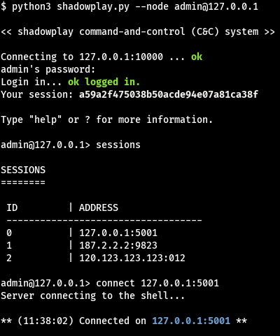

# shadowplay-cli
Client for Shadowplay Command-and-Control (C&amp;C) server. Master your shells. 



## How does it work? 
The client (shadowplay-cli.py) connect to an [node](https://github.com/entr0pie/shadowplay-node), which have shells connected into it. Then, the user can control any of the shells available on the server, including more than one in the same session.

## Installation

```
git clone https://github.com/entr0pie/shadowplay-cli
```

## Basic Usage

Starting the program:

```
python3 shadowplay-cli.py --node <user>@<ip>:port
```

After authenticated, the first thing to do is get the available shells.

```
$ sessions
```

To connect into any shell, type:

```
$ connect <ip>:<port>
```

## How can I contribute to the project? 

These topics are under development: 

- [X] Create basic connections and protocols srv-cli.
- [X] Implementing MD5 and TOKEN session methods.
- [X] Connecting to shell via ID.
- [ ] Error handling on connections and methods. 
- [ ] Use end-to-end cryptography on cli-srv communications.
- [ ] GET INFO function on the cli (get server and shell's basic information).
- [ ] Connecting in multiple shells at the same time.

## License
This project is under [GNU GPLv3.](LICENSE)
